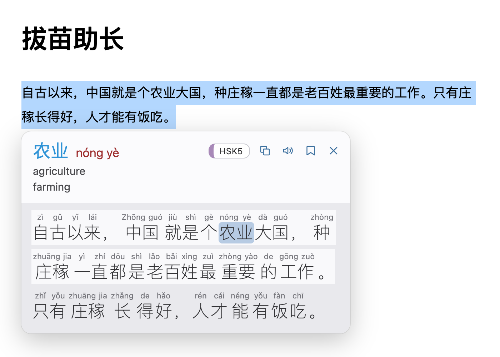
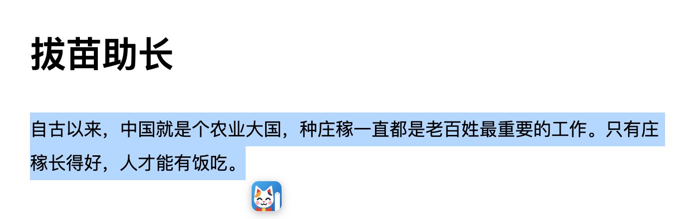
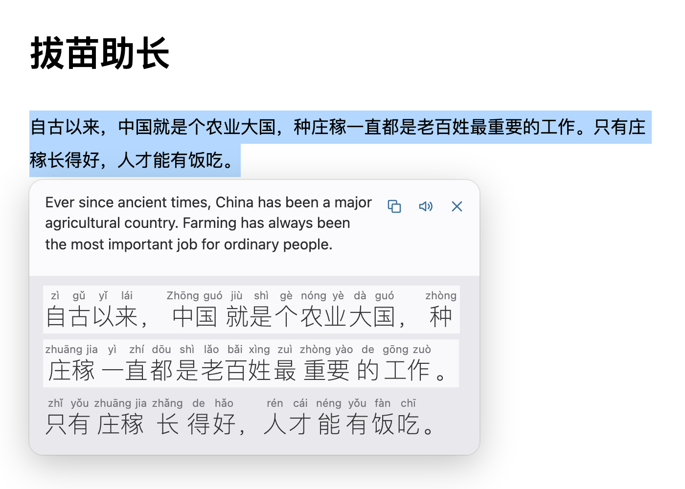
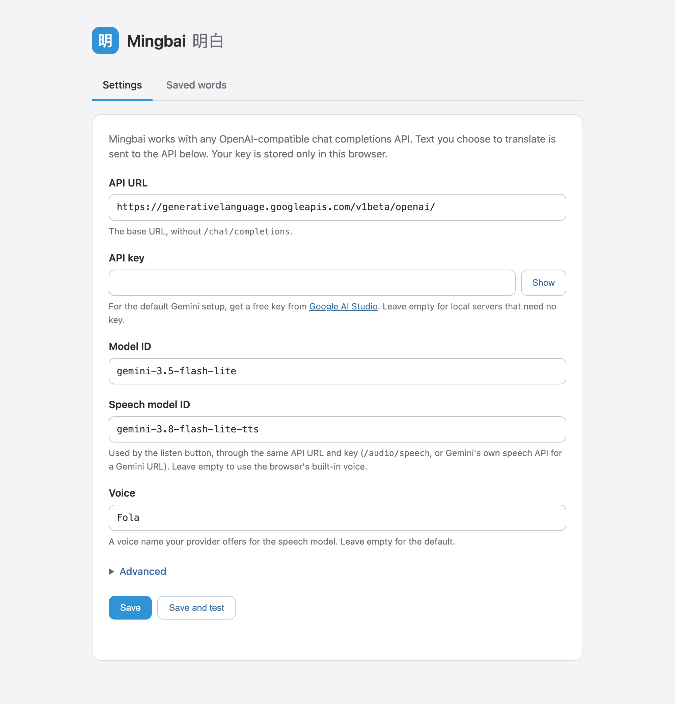

# Mingbai 明白

A Chrome extension for reading Chinese on any web page. Select some Chinese text and Mingbai shows it with pinyin above every word, an English translation of each sentence, and the meaning of any word you press.

It is free to use: it runs on your own API key, and Google's Gemini API has a free tier.



## What it does

- **Pinyin over every word**, with the text split into real words rather than single characters.
- **Sentence translation** in the top panel, following the sentence your mouse is on.
- **Word meanings**: press a word to see its pinyin, its meaning in this sentence and its HSK level.
- **Listen** to a word or a sentence, read slowly and clearly.
- **Save words** and export them as a CSV file, for example to import into Anki.
- **Copy** the word or the translation.
- Works on text inside shadow DOM, such as Bilibili comments.

| Select text, click the button | Read with the sentence translation |
| --- | --- |
|  |  |

## Use it for free

You need Chrome and a Google account.

### 1. Get a free Gemini API key

Open [Google AI Studio](https://aistudio.google.com/apikey), sign in and create an API key.

### 2. Get the extension

**Download a release (easiest).** Go to the [latest release](https://github.com/1337Impact/mingbai/releases/latest), download the `mingbai-…-chrome.zip` file and unzip it. Keep the unzipped folder somewhere permanent, because Chrome loads the extension from it every time it starts.

**Or build it from source.** This needs [Node.js](https://nodejs.org) 22 or newer:

```bash
git clone https://github.com/1337Impact/mingbai.git
cd mingbai
npm install
npm run build
```

### 3. Load it into Chrome

1. Open `chrome://extensions`.
2. Turn on **Developer mode** (top right).
3. Click **Load unpacked** and choose the unzipped folder, or `.output/chrome-mv3` if you built from source.

To update later, download the new release, replace the folder's contents and click the reload arrow on the extension's card.

### 4. Add your key

The settings page opens by itself after installing. The Gemini URL and models are already filled in, so paste your key and click **Save and test**. Chrome asks for permission to reach the API host; allow it.



### 5. Read

Select Chinese text on any page and click the blue **明** button that appears next to it.

- Move the mouse over a sentence to see its translation.
- Press a word to see its meaning. Press it again, or press empty space, to go back to the sentence.
- Press `Esc` or click the page to close the popup.

## What "free" means here

The default models, `gemini-3.5-flash-lite` for translation and `gemini-3.8-flash-lite-tts` for speech, are both free of charge on [Gemini's free tier](https://ai.google.dev/gemini-api/docs/pricing). Two things to know:

- The free tier has rate limits. If you hit them, wait a little or switch models in settings.
- On the free tier, Google may use what you send to improve its products. Paid keys are excluded from that. See the [Gemini API terms](https://ai.google.dev/gemini-api/terms).

## Other providers

Mingbai talks to any OpenAI-compatible chat completions API, so you can point it at OpenRouter, OpenAI, or a local server such as Ollama or LM Studio. Change the API URL, key and model ID in settings.

For speech, providers other than Gemini are called at `/audio/speech`. Leave the speech model empty to use the browser's built-in voice instead, which costs nothing and needs no API.

The **Advanced** section takes a JSON object that is merged into every translation request, for provider-specific options.

## Privacy

- The text you choose to translate is sent to the API you configured, and nowhere else.
- Your API key is stored in this browser's extension storage. It is used only by the extension's background worker, never by web pages.
- Saved words and cached translations stay in the browser.

## Development

```bash
npm run dev        # build in watch mode and open a browser with the extension
npm run build      # production build into .output/chrome-mv3
npm test           # unit tests
npm run test:e2e   # loads the built extension into Chromium against a mock API
npm run typecheck
```

The end-to-end tests need a Chromium that can load unpacked extensions. Install one with `npx playwright-core install chromium`, or set `CHROME_PATH`.

Where things are:

- `entrypoints/content/`: selection detection and the popup.
- `entrypoints/background.ts`: API calls, caching and HSK lookup.
- `entrypoints/options/`: the settings and saved words page.
- `lib/prompt.ts`: the prompt that asks the model for words, pinyin and meanings.
- `lib/stream-parser.ts`: turns the streamed reply into words, and keeps them aligned with the selected text.

## Credits

- HSK levels come from [complete-hsk-vocabulary](https://github.com/drkameleon/complete-hsk-vocabulary) by Yanis Zafirópulos, MIT licensed. See `assets/hsk.LICENSE.txt`.
- The reading layout is inspired by the Du Chinese app. Mingbai is not affiliated with it.

## Licence

[MIT](LICENSE)
